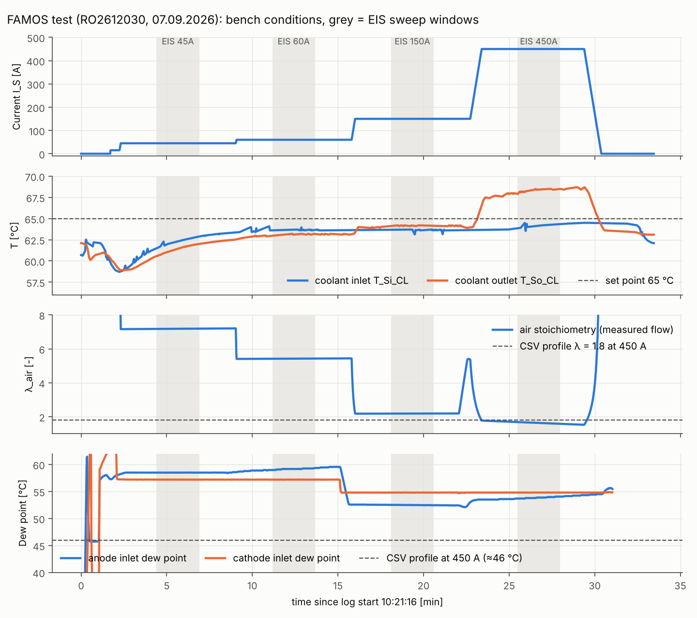
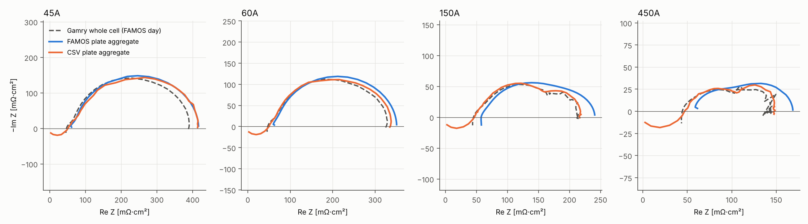
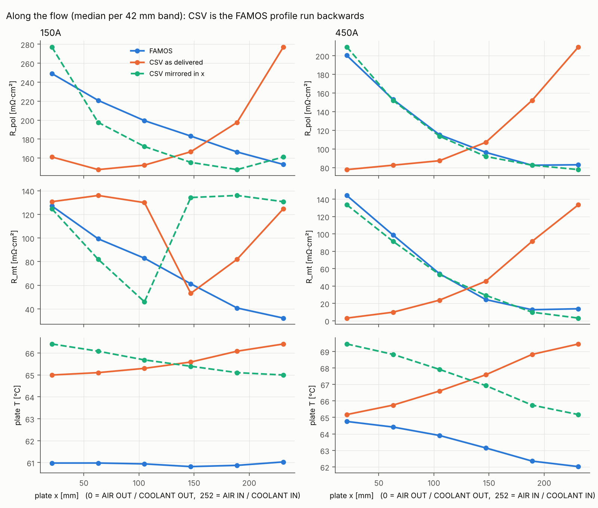

# FAMOS vs CSV local EIS: same plate, two tests

**Data used**

| | FAMOS | CSV |
|---|---|---|
| Measurement | RO2612030, 07.09.2026 | bench-tool spectra `Spectrum{2,6,8,9}_65degC_*` |
| Pipeline results | `snr_0.0_507664962e` (45 / 60 / 150 / 450 A) | `csv/<cond>/mode_default/snr_0.0_8305eeadb4` |
| Load conditions | MF4 bench log `…lokale_EIS_6_Boxen_3.mf4` | profile `Polcurve 2.3 611A` (ID 12013) |
| Whole-cell reference | Gamry `V26_092_HFR_10x_CurrVal_*.dta` | none |

Units are mΩ·cm² unless stated otherwise. Figures are in `docs/figures/famos_vs_csv/`.

---

## 1. Summary

1. **Both instruments see the same cell physics**, but only after the CSV map is **mirrored left–right**. At 450 A the profiles along the flow match almost perfectly: R_pol r = +0.97, R_mt r = +0.95, temperature r = +1.00. As delivered, they are anti-correlated (−0.76 / −0.75 / −1.00).
   - So the measuring plate sat the other way round, relative to the cell's flow field, in one of the two tests (Section 5).
   - The tool numbers the segments exactly as we do. The plate's own electronic fingerprint matches **without** mirroring.
2. **The FAMOS absolute level is too high.** Against the Gamry measured *at the same moment*:

   | | 45 A | 60 A | 150 A | 450 A |
   |---|---|---|---|---|
   | FAMOS aggregate \|Z\| vs Gamry | +8.5 % | +7.1 % | +12.6 % | +16.5 % |

   This is a measurement bias, made of:
   - a series offset of about +11 mΩ·cm² at high frequency (UC taps vs the Gamry sense leads);
   - a current-measurement deficit of 2.5–4.7 % (current closure);
   - a residual gain that grows with current.

   The CSV plate aggregate (another day) lies within +1…+7 % of the same Gamry spectra.
3. **The FAMOS HFR is the weakest FAMOS number.** The band stops at 3.0–3.8 kHz, where the spectrum is still capacitive, so HFR is a top-band mean and not an intercept.
   - Its value depends on which top frequency survives the quality gates: 2987 Hz at 60 and 450 A, 3797 Hz at 45 and 150 A. The result is 52.0 → 56.2 → 51.1 → 55.4, a non-physical zig-zag with current.
   - The FAMOS HFR map is spatially indistinguishable from random (neighbour contrast 0.87–1.21).
   - The intercept lies just out of reach. The Gamry crosses Z'' = 0 at 3.8–4.7 kHz. FAMOS's next step, at 4732 Hz, is recorded but is pure noise (SNR −37 to −52 dB).
4. **The FAMOS test was not at steady state.**
   - 45 and 60 A were measured during warm-up: coolant inlet 61.5–63.7 °C against a 65 °C set point, and the plate 4 K below the coolant.
   - Each sweep started only about 125 s after the current step.
   - At 450 A the air flow drifted from 13.2 to 11.5 Nl/min (λ_air 1.76 → 1.53, set point 1.8).
   - At 450 A the inlet gases were much wetter than in the CSV profile (dew point about 54–55 °C vs 46 °C).

   These conditions explain most of the rejected points (drift, distortion) and part of the differences between the tests.
5. **The decisive FAMOS advantages:**
   - local and whole-cell spectra recorded **simultaneously**, so closure checks are possible;
   - a **current-density map**;
   - **raw data with per-point uncertainty**;
   - clean spectra up to 3–3.8 kHz;
   - a **stable split between R_ct and R_mt**.

   The CSV data has none of these. It also carries a measuring-chain artifact above about 2 kHz (Re Z → 0 at 10 kHz), and its whole-cell file `z_cell.csv` is scaled by a constant 3.33 (Section 3.4).

---

## 2. Load conditions: what was different between the two tests

FAMOS values are means over the 150 s sweep windows (Figure 1). CSV values are the profile set points, which the profile holds for 360 s per step.

| | 45 A FAMOS | 45 A CSV | 60 A FAMOS | 60 A CSV | 150 A FAMOS | 150 A CSV | 450 A FAMOS | 450 A CSV |
|---|---|---|---|---|---|---|---|---|
| Current density [A/cm²] | 0.148 | 0.148 | 0.197 | 0.197 | 0.492 | 0.492 | 1.476 | 1.47 (449 A) |
| H₂ / air flow [Nl/min] | 1.90 / 5.38 | 1.88 / 5.31 | 1.90 / 5.41 | 1.88 / 5.31 | 1.90 / 5.45 | 1.88 / 5.31 | 4.70 / **12.2 (drifting)** | 4.70 / 13.51 |
| λ_H₂ / λ_air | 6.1 / 7.2 | 6.0 / 7.1 | 4.5 / 5.4 | 4.5 / 5.3 | 1.8 / 2.2 | 1.8 / 2.1 | 1.5 / **1.63 (1.76→1.53)** | 1.5 / 1.8 |
| p_out anode / cathode [bar a] | 1.42 / 1.22 | 1.42 / 1.22 | 1.46 / 1.26 | 1.46 / 1.26 | 1.74 / 1.54 | 1.74 / 1.54 | 2.20 / 2.00 | 2.20 / 2.00 |
| Dew point anode / cathode [°C] | 58.5 / 57.2 | 58.5 / 57.2 | 59.2 / 57.2 | 57.7 / 56.9 | 52.5 / 54.8 | 52.4 / 54.8 | **53.9 / 54.8** | **45.8 / 46.0** |
| Coolant flow [l/min] | 0.90 | 0.6 | 0.90 | 0.6 | 0.90 | 0.6 | 0.90 | 0.6 |
| Coolant in → out [°C] | **62.3 → 61.4** (set 65) | 65 (ΔT set 1 K) | 63.7 → 63.1 | 65 | 63.7 → 64.2 | 65 | 64.2 → 68.4 | 65 |
| Plate T (pipeline median) [°C] | **58.2** | 64.7 | 60.3 | 64.8 | 61.0 | 65.5 | 63.9 | 67.3 |
| Time at current before EIS | **≈125 s** | up to 360 s | ≈125 s | up to 360 s | ≈125 s | up to 360 s | ≈125 s | up to 360 s |
| History | ascending, **started from OCV 4 min earlier** | descending after 611 A, 10 min conditioning at 300 A | ascending | descending | ascending | descending | ascending | descending, directly after 611 A |
| Cell voltage U_CVM / U_S [V] | 0.821 / 0.808 | (not delivered) | 0.809 / 0.793 | – | 0.764 / 0.724 | – | 0.676 / 0.557 | – |

**What follows from this**

- **The gas flows, pressures and (up to 150 A) humidification are identical.** Both tests use the same OpConds 2.3 table. Differences at 45–150 A are therefore not caused by the gas set points.
- **Temperature and history differ at every current.** The FAMOS 45/60 A points were taken while the cell was still warming up: coolant 61.5 → 62.9 °C *during* the 45 A sweep, plate 4 K below the coolant. The CSV points come after high-current operation, from a well-hydrated, warm cell.
- **450 A is a different operating point:**
  - wetter inlet gases (dew point +8–9 K; about 63 % RH at the coolant temperature vs 40 %);
  - less air than set (λ 1.53–1.76 vs 1.8);
  - air flow ramping down throughout the sweep.

  These favour liquid water at the air outlet, which is exactly where FAMOS shows the largest R_mt.
- U_S − U_CVM = 0.12 V at 450 A, an extra 0.27 mΩ between the terminals and the cell taps (about 80 mΩ·cm²). It is outside the cell, but it shows how much the reference plane matters for any series resistance (Section 4.1).

*Figure 1. FAMOS bench log. Grey bands are the EIS sweeps. The coolant never reaches 65 °C before 450 A; the air stoichiometry falls during the 450 A step; the 450 A dew points sit 8–9 K above the CSV profile.*

---

## 3. Results: what is different

### 3.1 Plate medians

| | R_ohmic | ReZ 1 kHz | R_ct | R_mt | R_pol | \|Z\| 100 Hz | phase 100 Hz | T |
|---|---|---|---|---|---|---|---|---|
| 45 A FAMOS | 52.0 | 64.5 | 139.8 | 218.5 | 353.4 | 99.2 | −31.3° | 58.2 |
| 45 A CSV | 52.6 | 62.3 | 32.7 | 339.7 | 384.2 | 104.8 | −29.6° | 64.7 |
| 60 A FAMOS | **56.2** | 65.1 | 149.2 | 147.1 | 291.7 | 101.3 | −30.7° | 60.3 |
| 60 A CSV | 51.6 | 59.0 | 24.6 | 275.5 | 314.4 | 93.4 | −29.4° | 64.8 |
| 150 A FAMOS | 51.1 | 64.6 | 114.0 | 73.3 | 193.1 | 102.9 | −24.5° | 61.0 |
| 150 A CSV | 47.2 | 53.6 | 96.0 | 124.2 | 184.7 | 88.4 | −26.6° | 65.5 |
| 450 A FAMOS | **55.4** | 64.5 | 61.8 | 51.8 | 107.0 | 97.1 | −16.0° | 63.9 |
| 450 A CSV | 48.3 | 56.0 | 68.9 | 51.5 | 100.3 | 86.8 | −18.2° | 67.3 |

- **R_pol agrees within 4–8 %** at every current. It is the robust number.
- **The R_ct / R_mt split does not agree** (45 A: 140 / 219 vs 33 / 340). The CSV fit can only use data up to about 2.5 kHz (the band ends where the HF artifact starts), so the high-frequency arc is not pinned down. CSV R_ct varies 25–96 % between segments; FAMOS varies 7–13 %.
- **ReZ at 1 kHz is about 64.5 for FAMOS at every current; CSV gives 53.6–62.3.** The FAMOS value is lifted by the series offset (Section 4.1). In the CSV data, 1 kHz is already bending into the HF artifact.
- **Plate temperature is 4–6 K lower in FAMOS** at every current. This comes from the warm-up (Section 2) and possibly a sensor offset. It is worth checking against the coolant once the cell is steady.

### 3.2 Whole cell: both plates against the Gamry

| Re Z | 45 A | 60 A | 150 A | 450 A |
|---|---|---|---|---|
| Gamry HFR (intercept) | 46.7 | 47.1 | 45.2 | 44.4 |
| CSV aggregate HFR (intercept) | 50.7 | 50.0 | 46.7 | 46.9 |
| Re Z 1 kHz, Gamry / FAMOS / CSV | 53.7 / **62.1** / 60.4 | 54.3 / **62.5** / 56.9 | 52.1 / **61.9** / 52.5 | 50.9 / **61.1** / 54.5 |
| Re Z 0.25 Hz, Gamry / FAMOS / CSV | 389 / **417** / 414 | 326 / **351** / 336 | 212 / **241** / 216 | 140 / **169** / 148 |

*Figure 2. The CSV aggregate (another test day) follows the FAMOS-day Gamry more closely than the FAMOS aggregate recorded at the same time. FAMOS has the right shape but sits too far right: an offset plus a gain.*

### 3.3 Spatial quality

Neighbour contrast: 1.0 means the map looks like randomly placed values; lower means spatially organised. Each cell gives the values at 45 / 60 / 150 / 450 A.

| | FAMOS | CSV |
|---|---|---|
| R_ohmic (HFR) | **1.17 / 0.87 / 1.21 / 1.09** (random) | 0.82 / 0.69 / 0.75 / 0.63 |
| ReZ 1 kHz | 0.76 / 0.73 / 0.76 / 0.75 | 0.90 / 0.82 / 0.95 / 0.89 |
| R_mt | 0.38 / 0.48 / **0.16 / 0.14** | 0.75 / 0.59 / 0.57 / 0.21 |
| R_pol | 0.67 / 0.80 / **0.32 / 0.22** | 0.78 / 0.82 / 0.44 / 0.24 |

- **FAMOS gives the more coherent transport maps** (R_mt, R_pol) and the more coherent 1 kHz map.
- **CSV gives the more coherent HFR map.**
- Segment-to-segment differences in the FAMOS HFR are dominated by per-channel errors, not by the membrane.

### 3.4 Problems in the CSV data

- **Above about 2 kHz** every segment, at every current, loops back towards Re Z ≈ 0 at 10 kHz. That is the measuring chain, not the cell, and it is why passivity and the HF frequency-response checks fail. The pipeline excludes this part from the ECM and Kramers–Kronig.
- **The tool's `z_cell.csv`** is exactly 3.33 × the parallel sum of its own segments, at every frequency and with zero phase difference. It uses a different area convention; never compare it in absolute terms.
- **The data is a black box:**
  - no raw signals and no per-point uncertainty (the pipeline has to assume 2 %);
  - no DC current per segment, so no current-density map and no current closure;
  - no simultaneous whole-cell reference.

  As a consequence, 0–9 of 72 segments pass Kramers–Kronig at 2 % (median worst residual 3.5–4.5 %).

---

## 4. Why some FAMOS results are worse, and what causes it

### 4.1 Absolute level: +7…+17 % against the Gamry at the same moment

| Contribution | Evidence | Size |
|---|---|---|
| Series resistance between the UC taps and the Gamry sense leads (reference plane) | "R_s matched-band closure": local 59.5–60.9 vs whole cell 46.6–50.9 over the same top frequencies | **+10…+12 mΩ·cm²**, nearly constant |
| Segment currents read low | "current closure": Σ segment current = 95.3 / 95.8 / 96.9 / 97.5 % of I_S | **+2.5…+4.7 %** on \|Z\| |
| 5 unmeasured segments (33, 65–68, all at the air-inlet end, x = 224–248 mm) | recomputed from the 72-segment CSV data | up to +2 % at 450 A |
| Remaining gain that grows with current | after the three items above, 0.25 Hz is still 0 / 0 / +3 / +8 % high (45 / 60 / 150 / 450 A) | grows from 45 A to 450 A |

The first two are calibration items. The pipeline already has the hooks for them (`UC_SERIES_MOHM_CM2`, the current closure, the Gamry comparison). The third needs a bench check: AC gain of the shunt amplifiers at high DC current, and temperature compensation of the copper shunts (0.39 %/K).

### 4.2 HFR depends on how far the band reaches

FAMOS stops at 3.0–3.8 kHz, where every segment is still capacitive. The Gamry crosses Z'' = 0 **just above** that: between 3.8 and 4.7 kHz at 45–150 A, and between 3.0 and 3.8 kHz at 450 A.

FAMOS does record a step at **4732 Hz**. The runner's band limit `F_MAX = 4500 Hz` removes it from every segment (the 67 "outside_band" rejections at each current). Even with the chain lag corrected, that step has an SNR of −37 to −52 dB and a negative median Re Z: it is noise. Raising `F_MAX` does not help. The acquisition has to resolve 4–6 kHz first.

- R_ohmic is therefore a mean over the top of the band, and its value moves with the highest frequency that survives the gates.
- 60 A and 450 A lost their top step (to drift and harmonic-distortion rejections) and ended at 2987 Hz instead of 3797 Hz. Both came out about 4 mΩ·cm² higher.
- That is the whole of the 52 → 56 → 51 → 55 zig-zag.

### 4.3 Not at steady state

- **Rejected points by reason** (from `point_rejections.csv`):

  | Current | Rejections | Points kept |
  |---|---|---|
  | 60 A | 67 drift (coolant still rising) | |
  | 150 A | 67 harmonic distortion | |
  | 450 A | 164 harmonic distortion, 104 drift | 87 % (95 % at the lower currents) |

- **Warm-up at 45/60 A:** a cell 2–4 K cooler than the CSV cell has higher kinetic and transport losses, and the drift gate removes points.
- **450 A:** air flow ramping down, so λ is below the set point; wetter inlet. The result is more flooding at the air outlet and a 2.6 K plate gradient. Section 5 shows the *distribution* of R_mt/R_pol still matches the CSV test, so the spatial result is robust. Only the absolute level moves.

### 4.4 Measuring-chain timing

The chains differ by −62…+85 µs. The pipeline corrects this in-situ (phase spread at 2987 Hz drops from 30° to 2°). A bench calibration with the same sweep would make the correction exact rather than estimated.

---

## 5. Plate position: the CSV map is mirrored in x

*Figure 3. Medians per 42 mm band along x. Mirrored in x (green), the CSV profile lies on the FAMOS one at 450 A. As delivered (orange), it runs backwards.*

**Correlation between FAMOS and CSV maps under four geometric transforms** (per segment):

| Map | identity | mirror x | mirror y | rotate 180° |
|---|---|---|---|---|
| R_pol 450 A | −0.76 | **+0.97** | −0.76 | +0.97 |
| R_mt 450 A | −0.75 | **+0.95** | −0.75 | +0.96 |
| T 450 A | −1.00 | **+1.00** | −1.00 | +1.00 |
| R_pol 150 A | −0.66 | **+0.82** | −0.67 | +0.86 |
| R_ohmic, structure across y (x trend removed) | +0.41…0.52 | **+0.42…0.53** | ≈ 0 | −0.01…+0.12 |
| 100 Hz phase, segment-scale detail, 45/60 A | **+0.63…0.67** | +0.06…0.13 | – | – |

**Reading the table**

1. **The physics driven by the flow field is mirrored in x.** This covers temperature, R_mt and R_pol: oxygen depletion and water build-up at the air outlet, and coolant heating along its path.
   - In both datasets the hot end coincides with the high-R_mt end, so each is internally consistent.
   - The two datasets put that end on opposite sides of the plate.
2. **y is not mirrored.** The structure across the plate survives only without a y flip, so an in-plane 180° rotation is unlikely.
3. **The plate's own fingerprint is not mirrored.** The segment-scale phase detail at low current comes from the per-channel electronics and travels with the plate, and it matches *without* mirroring. The tool's segment numbers therefore address the same pads as ours. The mirror is not a numbering error in the CSV export.

**Conclusion.** Relative to the cell's flow field, the measuring plate was installed turned over about its short (y) axis in one of the two tests (left and right swapped, top and bottom kept). Alternatively, the gas and coolant connections were swapped to the other end.

Our FAMOS data is physically consistent with the drawn ports, AIR IN and COOLANT IN at x = 252:
- R_mt is largest and j_dc lowest at x = 0;
- the coolant warms towards x = 0;
- the bench log of order 2611976 shows the coolant inlet at the H₂-outlet end (`config.COOLANT_INLET_END`).

So the CSV test is the one with the swapped orientation. Evaluate it with `CSV_MIRROR_X = True` (runner settings cell) before comparing maps or interpreting inlet and outlet. The CSV results analysed here were run with it **off**.

---

## 6. The real advantage of FAMOS

1. **The same operating point everywhere:**
   - local spectra, the whole-cell Gamry, the DC current per segment and the bench log are recorded at the same time;
   - only this makes closures possible (aggregate vs Gamry, Σ currents vs I_S, series resistance);
   - those closures are what revealed the +11 mΩ·cm² offset and the 3–5 % current deficit. The CSV tool cannot reveal its own errors.
2. **Current-density map (j_dc).** It is the most direct local performance quantity, it confirms the transport picture (lowest j at the air outlet at 450 A), and it is absent in CSV.
3. **Raw data, re-evaluable, with per-point uncertainty.**
   - Quality gates (SNR, distortion, drift, KK) work on real σ; on CSV σ is assumed.
   - Every improvement to the pipeline can be applied retroactively, which is impossible for the tool's finished spectra.
4. **Clean spectra up to 3–3.8 kHz** without the chain artifact that corrupts the CSV above 2 kHz.
   - The R_ct / R_mt split is stable (variation between segments 7–13 % vs 25–96 %).
   - The transport maps are spatially sharper (neighbour contrast 0.14–0.32 at 150/450 A).
5. **Linked to the bench log and to the Abgleich**, so the measuring chain itself can be characterised: via resistances, chain lag, card gains.

---

## 7. What to focus on next

| Priority | Action | Fixes |
|---|---|---|
| 1 | **Absolute calibration per run against the simultaneous Gamry:** • set `UC_SERIES_MOHM_CM2` ≈ 11–12 (from the matched-band closure); • correct the current gain by the measured closure; • keep the Gamry comparison as an acceptance check (aim: \|Z\| within ±5 %) | Section 4.1, about two-thirds of the bias |
| 2 | **Reach the HF intercept** (3.8–4.7 kHz on this cell): • raise the FAMOS sampling rate and/or the excitation amplitude so that 4–6 kHz is measured with usable SNR (today the 4732 Hz step is at −37…−52 dB); • until then, report HFR at a **fixed** frequency, identical for every current (e.g. Re Z at 2.4 kHz) | Section 4.2 zig-zag; random-looking HFR map |
| 3 | **Steady-state protocol:** • condition first (the CSV profile does 10 min at 300 A, then a full pol curve); • start EIS only when coolant inlet is at set ±0.5 K, dT/dt < 0.05 K/min and flows are at set ±2 %; • ≥ 5 min per current; • measure descending as well as ascending | Sections 2 and 4.3: drift/distortion rejections, warm-up bias, hysteresis |
| 4 | **Fix the 450 A air-flow drift** (13.2 → 11.5 Nl/min under a 13.5 set point) and **match humidification** to the profile (dew point 46 °C at 450 A, not 54–55 °C) | 450 A operating point |
| 5 | **Cable segments 33 and 65–68** (air-inlet end) | Coverage 96 % → 100 %; ≤ 2 % aggregate bias |
| 6 | **Bench-calibrate the chains with the same sweep** (gain file from the Abgleich bode sweeps) | ±85 µs lags, card-specific phase |
| 7 | **Record the plate orientation in every test** (photo, port labels). Add an automatic check: at high current, the hot end and the high-R_mt end must coincide with the configured outlet | Section 5 |
| 8 | Report **R_pol** (robust) and add DRT; treat the R_ct / R_mt split as model-dependent | Section 3.1 |
| 9 | One **back-to-back test**: same cell and same day, CSV tool and FAMOS, same profile | Separates instrument differences from cell-state differences, which this comparison cannot fully do |
